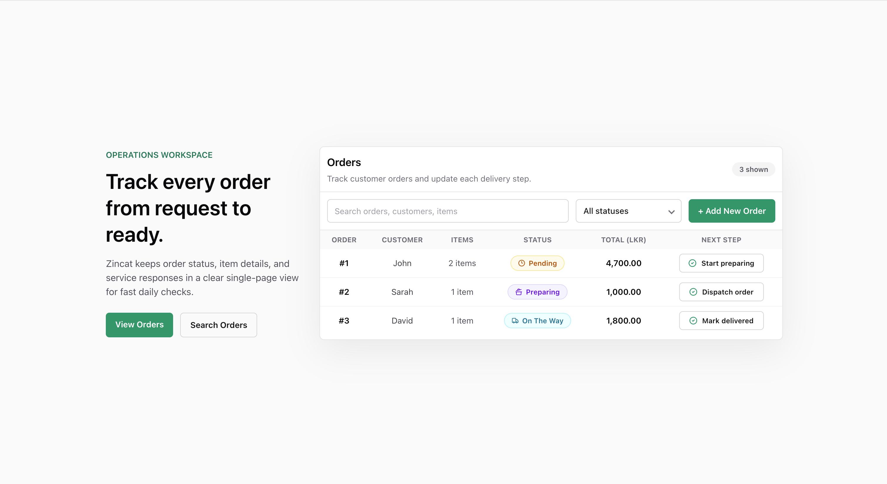
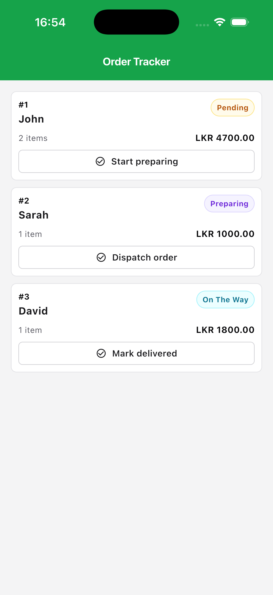

# ZinCat Assignment Mini Order Tracker

A small order-tracking project with three parts:

- `backend`: Express + TypeScript API
- `web`: React + Vite web app
- `mobile`: Flutter mobile app

Run the backend first, then start the web or mobile app in a separate terminal.

## Screenshots

<p>
  
  
</p>

## Prerequisites

- Node.js and npm
- Flutter SDK
- A browser, simulator, emulator, or connected device for the Flutter app

## Run the Backend

```bash
cd backend
npm install
npm run dev
```

The API runs at:

```text
http://localhost:3000/api/v1
```

Main endpoints:

- `GET /orders`
- `POST /orders`
- `PATCH /orders/:id/status`

## Run the Web App

```bash
cd web
npm install
npm run dev
```

Vite will print the local URL in the terminal, usually:

```text
http://localhost:5173
```

The web app expects the backend to be running at `http://localhost:3000/api/v1`.

## Run the Mobile App

```bash
cd mobile
flutter pub get
flutter run
```

To run it in Chrome:

```bash
cd mobile
flutter run -d chrome
```

The mobile app also points to `http://localhost:3000/api/v1` in `mobile/lib/core/constants/api_constants.dart`. If you run on an Android emulator, use `http://10.0.2.2:3000/api/v1` instead. If you run on a physical device, use your computer's LAN IP address.

## What Is Done

- Backend API for listing orders, creating orders, and advancing an order status.
- In-memory sample order data, item data, status flow, validation, CORS, and shared response handling.
- React web app that loads orders, shows loading/error states, filters/searches orders, displays status badges, and advances order status.
- Flutter app that loads orders, shows loading/error/empty states, supports pull-to-refresh, and advances order status.

All requested parts are complete. There are no known unfinished submission items. The backend uses in-memory data, so created orders and status updates reset when the server restarts.

## AI Usage and Manual Changes

AI assistance was used only for UI enhancement ideas, utility function creation, dummy data setup, theme color design, generated comments/wording cleanup, HTTP client development support, and drafting parts of this README.

The base implementation was done by hand. This includes the project architecture, backend endpoint creation, route and status behavior, validation handling, response handling, state handling, web and mobile feature logic, integration between the clients and backend, and final review/editing of the code.
